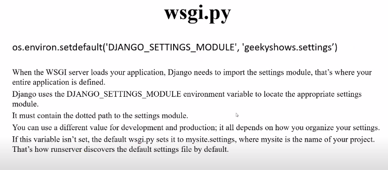
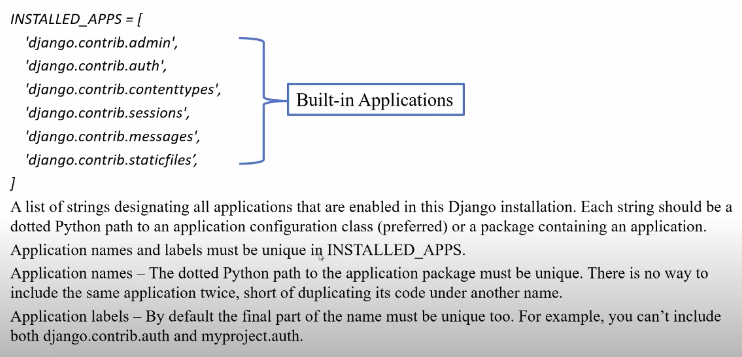

# Learn Django

## Table of Contents

- [Learn Django](#learn-django)
  - [Table of Contents](#table-of-contents)
    - [What is Framework](#what-is-framework)
    - [What is Web Framework](#what-is-web-framework)
    - [Model View Template (MVT)](#model-view-template-mvt)
    - [Introduction to Django](#introduction-to-django)
    - [Requirements for Learning Django](#requirements-for-learning-django)
    - [Install Django in Virtual Environment and Create Django Project](#install-django-in-virtual-environment-and-create-django-project)
    - [`init` `wsgi` and `asgi` Files in Django](#init-wsgi-and-asgi-files-in-django)
    - [`settings.py` file in Django](#settingspy-file-in-django)
    - [Start and Stop Django Server](#start-and-stop-django-server)
    - [Create and Install Django Application](#create-and-install-django-application)
    - [Application Directory Structure in Django](#application-directory-structure-in-django)
    - [Function Based Views in Django](#function-based-views-in-django)

### What is Framework

A framework is a set of conceptual structure and guidelines, used to build something useful. As a programmer, you don’t need to start from scratch when you have tools designed to help you with your projects. Frameworks are software that is developed and used by developers to build applications.

```text
Finally a framework is may include predefined classes and functions that can be used to process input,
manage hardware devices, and interact with system software.
```

**Why use framework**:

1. Collection of tools
2. No need to start from scratch
3. Save time
4. Improve productivity
5. Clean code
6. Reuseable code
7. Testing
8. Debugging

### What is Web Framework

A `Web Framework` (WF) or `Web Application Framework` which helps to build web applications.

- Laravel
- Codeigniter
- Zend
- Django
- Spring

### Model View Template (MVT)

`MVT` is a design pattern that separates an application into three main logical components **Model**, **View**, **Template**

`Model`: The model responsible to handle database. It is a data access layer which handles the data.

`View`: The use can send request by interacting with **template**, the view handles these requests and sends to **model** then get appropriate response from **model**, sends response to template.

`Template`: It represents how data should be presented to the application user. User can read or write data from the template.


- **View**:
  - Server side logic
  - Process GET/POST
  - Get data from the User
  - Get data from the Model
  - Pass data to Template
- **Model**:
  - Process Data
  - Insert/Update DB
  - Communicate with View
- **Template**:
  - User Interface
  - HTML/CSS
  - Get data from View

### Introduction to Django

**Django** is free, open-source Python based High-Level **Web Framework**. Follow **MVT** architecture.

Build on Django:

- Youtube
- Instagram
- Bitbucket
- NASA
- Softify

### Requirements for Learning Django

- HTML
- CSS
- JavaScript
- SQL
- Python
- MVT
- PIP
- Bootstrap

### Install Django in Virtual Environment and Create Django Project

```console
root@admin: ~$ python3 --version
Python 3.8.1

root@admin: ~$ django-admin --version
.... Install or not? ...

# create virtual env first
# install django
root@admin: ~$ pip install django
```

**Django Project**: A Django project may  contain multiple project **application**, which means a group of application and files is called as Django project.

> An application is a part of Django project.

**Demo**:

- SchoolProject
  - Registration App
  - Fees App
  - Exam App
  - Attendance App
  - Result App

**Create and Django Project**:

```console
# Syntax
# django-admin startproject project_name
# example
root@admin: ~$ django-admin startproject schoolproject

# go inside the schoolproject
root@admin: ~$ cd schoolproject
root@admin: ~$ ls
manage.py*  schoolproject/

# run django project
root@admin: ~$ python manage.py runserver
February 25, 2021 - 03:52:50
Django version 3.1.5, using settings 'schoolproject.settings'
Starting development server at http://127.0.0.1:8000/
Quit the server with CONTROL-C.
```

### `init` `wsgi` and `asgi` Files in Django

**__init__.py**: An `empty` file that tells Python that this directory should be considered a Python `package`.

**wsgi.py**: `Web Server Gateway Interface`

```py
# import os module
import os

# importing function from the asgi module
# django: package, core:package, wsgi: module, get_wsgi_application: function
from django.core.wsgi import get_wsgi_application

# Defining settings module to environment variable
# environ: mapping object represent the string environment.
# setdefault: function, DJANGO_SETTINGS_MODULE: environment variable
# 'schoolproject.settings': value
os.environ.setdefault('DJANGO_SETTINGS_MODULE', 'schoolproject.settings')

# application: callable(), get_wsgi_application: This function return wsgi callable
application = get_wsgi_application()
```



> Note:

```py
# use different value for wsgi server.
os.environ.setdefault('DJANGO_SETTINGS_MODULE', 'schoolproject.dev_settings')
```

**asgi.py**: Same as `wsgi.py` file. `the Asynchronous Server Gateway Interface`

### `settings.py` file in Django

**Secret Key**: `str`


**Debug**: `Boolean`


**Allowed Host**: `List contains string`


**Installed Apps**: `List contains strings`



**Templates**: `Dict`


**Database**: `Dict`


**Others**:


### Start and Stop Django Server


**Note**: For `Stop` Server using `CTRL + C` in your Terminal.

### Create and Install Django Application

A Django projects contains one or more `applications` which means we create application inside project folder.

**Create Applications**:

**Syntax**: `python3 manage.py startapp app_name`

```console
# Inside project directory
root@admin: ~$ ls
your_project_directory_name manage.ppy

# create multiple applications
root@admin: ~$ python3 manage.py startapp your_app_name
root@admin: ~$ python3 manage.py startapp course
root@admin: ~$ python3 manage.py startapp fees
root@admin: ~$ python3 manage.py startapp results
```

**Install Projects**:

To install `application` in django we need to specify our newly created django application name into the projects main
directory `settings.py` file.

```py
INSTALLED_APPS = [
    'django.contrib.admin',
    '.....',
    'course',
]
```

### Application Directory Structure in Django

```bash
root@admin: ~$ ls
admin.py*  apps.py*  __init__.py*  migrations/  models.py*  tests.py*  views.py*
```

**migrations/**: This folder contains `__init__.py` file which means it's a python package. It aslo contains all files which are created after running `makemigrations` command.

**__init__.py**: The folder contains `__init__.py` file is considered as Python `package`.

**admin.py**: This file is used to `register` `sql` tables so we could perform `CURD` operation from `Admin` application. Admin application is provided by Django to perform `CURD` operation.

**apps.py**: This file is used to `config` app.

**models.py**: This file is used to create our own model class later these classes will be converted into database table by django for our application.

**test.py**: This is files is used to create tests.

**views.py**: This file is used to create `view`. We write all the `business logic` related code in this file.

### Function Based Views in Django

`Two` types `view` in Django:

- Function Based View
- Class Based View

<center>
<h2>Function Based View</h2>
</center>

- A function based view , is a Python function that takes a `Web Request` and returns `Web Response`.
- The response can be `HTML` contents of a web page, or `redirect`, or `404` error, or an `XML` document, or an `image` or `anything`.
- Each `view` function takes an `HttpRequest` object as `first` parameter.
- Each `view` function is responsible for return and `HttpResponse` object.

**Syntax**:

**HttpResponse** is a class.

```py
from django.http import HttpResponse

def index(request):
  return HttpResponse('<h1>Index Page</h1>')

def home(request):
  context = '<h1>Home Page</h1>'
  return HttpResponse(context)

def learn_math(request):
  a = 10 + 20
  return HttpResponse(a)
```

- We use `urls.py`  file of the application to write functions  which may contain `business logic` of application, later it required to define `url` name for this function in the `urls.py` file of the project.

**Url Mapping**:

`urls.py`

```py
from django.contrib import admin
from django.urls import path, include
from course import views

urlpatterns = [
    path('admin/', admin.site.urls),
    path('index/', views.index, name='index')
]
```

**Next**: [URL](https://youtu.be/XQYSlaEBSzw?list=PLbGui_ZYuhigchy8DTw4pX4duTTpvqlh6&t=990)
