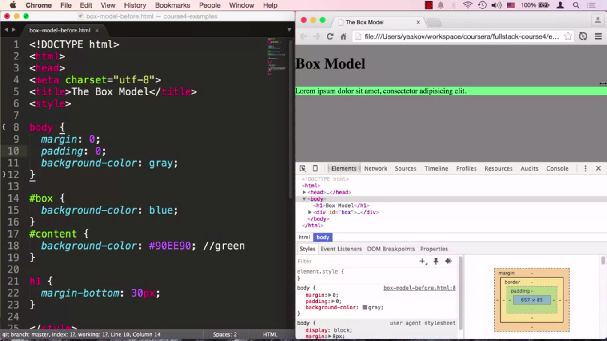
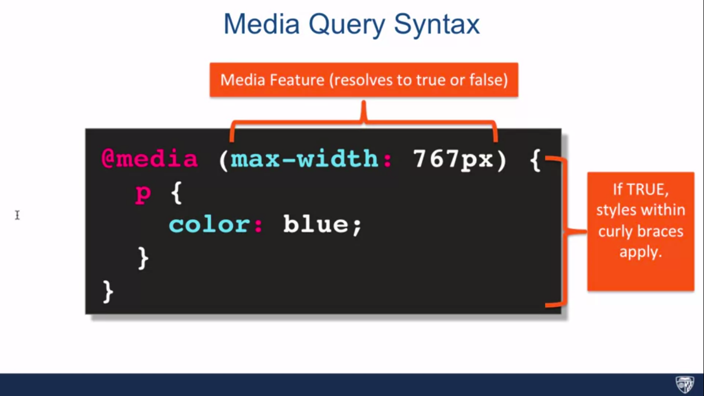

# HTML, CSS, and Javascript for Web Developers

## Table of Contents

- [HTML, CSS, and Javascript for Web Developers](#html-css-and-javascript-for-web-developers)
  - [Table of Contents](#table-of-contents)
    - [Introduction to HTML5](#introduction-to-html5)
      - [Development Environment Setup](#development-environment-setup)
      - [What is HTML](#what-is-html)
      - [Anatomy of HTML Tag](#anatomy-of-html-tag)
      - [Basic HTML Document Structure](#basic-html-document-structure)
      - [HTML Content Models](#html-content-models)
      - [Lecture-6: Semantic Elements](#lecture-6-semantic-elements)
      - [Lecture-7: List](#lecture-7-list)
      - [Lecture 8: HTML Character Entity References](#lecture-8-html-character-entity-references)
      - [Lecture 9: Creating Links](#lecture-9-creating-links)
      - [Displaying Images](#displaying-images)
    - [Introduction to CSS3](#introduction-to-css3)
      - [Power of CSS](#power-of-css)
      - [Anatomy of CSS](#anatomy-of-css)
      - [Element, Class and ID Selector](#element-class-and-id-selector)
      - [Combining Selectors](#combining-selectors)
      - [Pseudo-Class Selectors](#pseudo-class-selectors)
      - [Style Placement](#style-placement)
      - [Styling Text](#styling-text)
      - [The Box Model](#the-box-model)
      - [Background Property](#background-property)
      - [Positioning Elements by Floating](#positioning-elements-by-floating)
      - [Absolute and Relative Positing](#absolute-and-relative-positing)
      - [Media Queries - 1](#media-queries---1)
      - [Media Queries - 2](#media-queries---2)
      - [Responsive Design - 1](#responsive-design---1)
      - [Responsive Design - 2](#responsive-design---2)
      - [Bootstrap Starter](#bootstrap-starter)
      - [Bootstrap Grid - 1](#bootstrap-grid---1)
      - [Bootstrap Grid - 2](#bootstrap-grid---2)
    - [Coding the Static Restaurant Site](#coding-the-static-restaurant-site)

### Introduction to HTML5

Learning **HTML** is not hard.

#### Development Environment Setup

- Sign up for an account on `Github.com`
- Google Chrome Browser `CDT`
- Sublime Text 3 Or `Vscode`
- `Git`
- Browser Sync

#### What is HTML

**HTML** - Hyper Text Markup Language

**Hypertext** - Text contains links. One document point another document and another links another.

**Technologies that drive the web**:

- **HTML**(Structure), [talk about component].
- **CSS**(Style), [Color, layout, font size].
- **JavaScript**(Behavior)

#### Anatomy of HTML Tag

```html
<!-- <p>: start tag/opening tag -->
<!-- </p>: end tag/closing tag  --
<!-- p: element name -->
<p> ...content ... </p>
```

Most of the **HTML** tag has `opening` and `closing` tag

But not all. Example:

```html
<!-- br: line break -->
<br>
<!-- hr: horizontal rule -->
<hr>
```

Every **HTML** tag has predefined `attribute`. Example

```html
<!-- attribute: (name = "value") pair -->
<!-- id: attribute name, myId: attribute value -->
<!-- id value should be unique in the whole web page. -->
<p id='myId'></p>
```

**Spacing**:


**Quotes**:


#### Basic HTML Document Structure

```html
<!-- must have -->
<!-- html is not case sensitive, so doctype and DOCTYPE is same. -->
<!DOCTYPE html>
<!-- inside <html> ...contain the entire document ... </html> -->
<html lang="en">
<!-- inside <head> ... describe the main content of the entire document ... </head> -->
<head>
    <meta charset="utf-8">
    <!-- title of the page -->
    <title>Coursera is Cool!</title>
</head>
<!-- root content for all the visible tag in the document. Viewport -->
<body>
    <p>Coursera is cool. I'm <span>learning</span> so much!</p>
</body>
</html>
```

#### HTML Content Models

| Block-Level Elements                             | Inline Elements                     |
| ------------------------------------------------ | ----------------------------------- |
| Render to begin on a new line(by default)        | Render on the same line(by default) |
| May contain inline or other block-level elements | May contain other inline elements   |

- HTML5 replaces these definitions with more complex set of content categories.
- However, this distinction remains practical because it aligns well with existing **CSS** rules.

[HTML Content Models](https://www.w3.org/TR/2011/WD-html5-20110525/content-models.html)

```html
<!DOCTYPE html>
<html lang='en'>
    <head>
        <meta charset="utf-8">
        <title>div and span elements</title>
    </head>
    <body>
        <!-- div: generic block level element -->
        <div>***DIV 1: Some content here ***</div>
        <div>*** DIV 2: Following right after div 1 ***</div>
        <!-- span: generic inline element -->
        <span>*** SPAN 1: Following right after div 2 ***</span>
        <div>
            *** Div3: Following right after span 1
            <span> *** SPAN 2: INSIDE div 3 ***</span>
            Continue content of div 3 ***
        </div>
    </body>
</html>
```

**Preview Above HTML Code**:


#### Lecture-6: Semantic Elements

```html
<!doctype html>
<html>
<head>
  <meta charset="utf-8">
  <title>Heading Elements</title>
</head>
<body>
  <header>
    header element - Some header information goes here. Usually consists of company logo, some tag line, etc. Sometimes, navigation is contained in the header as well.
    <nav>nav (short for navigation) element - Usually contains links to different parts of the web site.</nav>
  </header>
  <h1>Main Heading of the Page (hard not to have it)</h1>
  <section>
    Section 1
    <article>Article 1</article>
    <article>Article 2</article>
    <article>Article 3</article>
  </section>
  <section>
    Section 2
    <article>Article 4</article>
    <article>Article 5</article>
    <article>Article 6</article>
    <div>Regular DIV element</div>
  </section>
  <aside>
    ASIDE - Some information that relates to the main topic, i.e., related posts.
  </aside>

  <footer>
    JHU Copyright 2015
  </footer>
</body>
</html>
```

**Preview**:


> Heading, section, article, aside & footer are all block level element that's why every element preview in it's own line.

#### Lecture-7: List

- List provide a natural and commonly used grouping of content.
- Very often, list are used for structuring navigation portions of the web page.

```html
<!DOCTYPE html>
<html>

<head>
  <meta charset="utf-8">
  <title>Ordered Lists</title>
</head>

<body>
  <h1>Ordered list</h1>
  <div>
    Oreo cookie eating procedure:
    <ol>
      <li>Open box</li>
      <li>Take out cookie</li>
      <li>a Double Oreo
        <ol>
          <li>Peel off the top part</li>
          <li>Place another cookie in the middle</li>
          <li>back the top part</li>
        </ol>
      </li>
      <li>Enjoy</li>
    </ol>
  </div>
</body>
</html>
```


#### Lecture 8: HTML Character Entity References

- Help avoid rendering issues.
- Safeguard against more limited character encoding.
- Provide character not available on a keyboard.


| Character Entity |                                        |
| ---------------- | -------------------------------------- |
| `&lt;`           | `<`                                    |
| `&gt;`           | `>`                                    |
| `&amp;`          | `&`                                    |
| `&copy;`         | `copyright sign`                       |
| `&nbsp;`         | `Non breaking space, text do not wrap` |
| `&quot;`         | `"`                                    |

#### Lecture 9: Creating Links

**Internal Links**:

```html
<h1>Internal Links</h1>
<section>
  We can link to a file in the same directory as this HTML file like this:
  <a href="same-directory.html" title="same dir link">Linking to a file in the same directory</a>
  <a href="same-directory.html" title="same dir link">
    <div> DIV Linking to a file in the same directory</div>
  </a>
</section>
```

**External Links**:

```html
<section>
  <p>
    Let's link to a Facebook Fan page I created for this course!
    <!-- link to Facebook page WITH TARGET-->
    <a href="http://www.facebook.com/CourseraWebDev"
    target="_blank" title="Like Our Page!">Course Facebook Page</a>
  </p>
</section>
```

**Same Page Links**:

```html
<h1 id="top">Links to Sections of The Same Page</h1>

<section>
  <ul>
    <!-- Link to every section in the page -->
    <li><a href="#section1">#section1</a></li>
    <li><a href="#section2">#section2</a></li>
    <li><a href="#section3">#section6</a></li>
  </ul>
</section>

<!-- section 1 -->
<section id="section1">
  <h3>(#section1) Section 1</h3>
  <p>Lorem ipsum dolor sit amet, consectetur adipisicing elit.</p>
</section>

<!-- section 2 -->
<section id="section2">
  <h3>(#section2) Section 2</h3>
  <p>Lorem ipsum dolor sit amet, consectetur adipisicing elit.</p>
</section>

<!-- last section -->
<div>
  <h2><a name="section3">(#section3) Section 3</a></h2>
  <p>
    Back to top: <a href="#top">Back to Top</a>
  </p>
</div>
```

#### Displaying Images

- Images can enhance your site.
- Remember to specify width and height attributes whenever possible.
- Inline Element

| Snippets                                                                                     | Discussion     |
| -------------------------------------------------------------------------------------------- | -------------- |
| ``     | Internal Links |
| `` | External Links |

### Introduction to CSS3

#### Power of CSS

[CSS Zen Garden](http://csszengarden.com/)

#### Anatomy of CSS

```text
selector {
  property: value;
}
```

```html
<head>
<title> ... </title>
<style>
p {
  color: blue;
  font-size: 20px;
  width: 200px;
}

h1 {
  color: green;
  font-size: 36px;
  text-align: center;
}
</style>
</head>
```

#### Element, Class and ID Selector

```css
/* element selector */
p {
  /* property: value; */
  color: blue;
}

/* class selector */
.row {
  /* property: value; */
  background-color: red;
  opacity: .6; /* value can be between 0.0 to 1.0*/
}

#mainId {
  /* property: value; */
  text-position: center;
  font-size: 10px;
}
```

#### Combining Selectors

```css
/* Element with class selectors */
/* <p class="big"> ...</p> */
p.big {
  font-size: 10px;
}

/* Child Selector */
/* Every <p> that is a direct child of <article> */
article > p {
  color: blue;
}

/* Descendant Selector */
/* Every p that is inside of article */

article p {
  color: blue;
}

/* Not limited to element selectors */
.colored p {
  color: blue;
}

article > .colored {
  color: blue;
}
```

| Name                           | Snip                  | Affect                                            |
| ------------------------------ | --------------------- | ------------------------------------------------- |
| Element with `class selectors` | `p.big { .... }`      | Every `<p>` with class `big`                      |
| `Child` Selector               | `article > p { ... }` | Every `<p>` that is a direct child of `<article>` |
| `Descendant` Selector          | `article p { ... }`   | Every `<p>` that is inside of `<article>`         |
| Element Selectors              | `colored p { ... }`   | Any `<p>` with `class="colored"`                  |

#### Pseudo-Class Selectors

```css
/*
  selector:pseudo-class {
    ....
  }
  * There are many pseudo class selector exist....
  * :link
  * :visited
  * :hover
  * :active
  * :nth-child(....)
*/
```

```html
<!DOCTYPE html>
<html>
<head>
<meta charset="utf-8">
<title>Pseudo Class Selectors</title>
<style>
/* Styles go here. */
header li {
  list-style: none;
}
a:link, a:visited {
  text-decoration: none;
  background-color: green;
  border: 1px solid blue;
  color: black;
  display: block;
  width: 200px;
  text-align: center;
  margin-bottom: 1px;
}

a:hover, a:active {
  background-color: red;
  color: purple;
}

header li:nth-child(3) {
  font-size: 24px;
}

section div:nth-child(odd) {
  background-color: gray;
}

section div:nth-child(4):hover {
  background-color: green;
  cursor: pointer;
}

</style>
</head>
<body>
<h1>Pseudo Class Selectors</h1>

<header>
  <ul>
    <li><a href="/">Home</a></li>
    <li><a href="http://goo.gl/V0Wl6s" target="_blank">AngularJS Course</a></li>
    <li><a href="http://www.facebook.com/CourseraWebDev" target="_blank">Facebook Fan Page</a></li>
  </ul>
</header>

<section>
  <div>DIV 1</div>
  <div>DIV 2</div>
  <div>DIV 3</div>
  <div>DIV 4</div>
  <div>DIV 5</div>
  <div>DIV 6</div>
  <div>DIV 7</div>
  <div>DIV 8</div>
  <div>DIV 9</div>
  <div>DIV 10</div>
  <div>DIV 11</div>
  <div>DIV 12</div>
  <div>DIV 13</div>
  <div>DIV 14</div>
  <div>DIV 15</div>
  <div>DIV 16</div>
  <div>DIV 17</div>
  <div>DIV 18</div>
  <div>DIV 19</div>
  <div>DIV 20</div>
</section>

</body>
</html>
```

| Name        | Snip                                             |
| ----------- | ------------------------------------------------ |
| `:link`     | `a:link { ... }`                                 |
| `:hover`    | `a:hover { ... }`                                |
| `:visited`  | `a:visited { ... }`                              |
| `:active`   | `a:active { ... }`                               |
| `:nth-chil` | `sectoion div:nth-child(odd/1/..):hover { ... }` |

#### Style Placement

```html
<!DOCTYPE html>
<html>
<head>
<meta charset="utf-8">
<title>Style Placement</title>
<link rel="stylesheet" href="style.css">
<style>

h2 {
  color: maroon;
}

</style>
</head>
<body>
<h1>Style Placement</h1>
<h2>Subheading 1</h2>
<p>Lorem ipsum dolor sit amet, consectetur adipisicing elit.</p>
<h2>Subheading 2</h2>
<p style="text-align: center;">I am centered!</p>

</body>
</html>
```

| Name                               | Snip                                       |
| ---------------------------------- | ------------------------------------------ |
| `Inline Style`, **Least Use**      | `<p style="text-align: center;"> ... </p>` |
| `Internal Style`                   | `<style> h2 { property: value; } </style>` |
| `External Stylesheet` **Most Use** | `<link rel="stylesheet" href="style.css"`  |

> Real sites almost always use external styles

#### Styling Text

```html
<!DOCTYPE html>
<html>

<head>
    <meta charset="utf-8">
    <title>Styling Text</title>
    <style>
        .style {
            font-family: Arial, Helvetica, sans-serif;
            color: #0000ff;
            /* italic, normal, oblique */
            font-style: italic;
            /* font-weight */
            font-weight: bold;
            /* default 16px */
            font-size: 18px;
            /* capitalize, lowercase, uppercase */
            text-transform: capitalize;
            /* center, left, right, justify */
            text-align: right;
        }
    </style>
</head>

<body>
    <p>You can get commonly used font combinations from <a
            href="http://www.w3schools.com/cssref/css_websafe_fonts.asp">http://www.w3schools.com/cssref/css_websafe_fonts.asp</a>.
        Lorem ipsum dolor sit amet, consectetur adipisicing elit. Quisquam quod necessitatibus a ullam dolorum amet
        reprehenderit sit laudantium reiciendis aperiam. </p>
    <p class="style">Lorem ipsum dolor sit amet, consectetur adipisicing elit. Laboriosam fugiat repudiandae fugit porro
        commodi.</p>
</body>

</html>
```


#### The Box Model

```html
<!DOCTYPE html>
<html>
<head>
<meta charset="utf-8">
<title>The Box Model</title>
<style>

/* *: Select every element  */
/* using border-box for sizing box
  e.k.a width=300px; now if we set border-sizing=border-box;
  300 pixels is = margin + padding + border + rest of width
 */
* {
  box-sizing: border-box;
  margin: 0;
  padding: 0;
}

/* inherently apply this properties element to apply */
body {
  background-color: gray;
}

/*  */
#box {
  background-color: blue;
  padding: 10px;
  border: 5px solid black;
  width: 300px;
  height: 50px;
  margin-top: 50px;
  /* if overflow occur a scroll bar is present */
  overflow: auto;
}
#content {
  background-color: #90EE90; /* green */
}

h1 {
  margin-bottom: 30px;
}

</style>
</head>
<body>

<h1>Box Model</h1>

<div id="box">
  <div id="content">Lorem ipsum dolor sit amet, consectetur adipisicing elit. Suscipit error quis ab perspiciatis eos inventore recusandae iste itaque numquam facilis, tenetur. Doloribus officiis quae facilis, nisi, ex similique. Animi, perferendis.
  </div>
</div>


</body>
</html>
```





#### Background Property

```html
<!DOCTYPE html>
<html>
<head>
<meta charset="utf-8">
<title>Background</title>
<style>
#bg {
  width: 500px;
  height: 500px;
  background: url('yaakov.png') no-repeat top center;
  background-color: blue;
}


</style>
</head>
<body>
<div id="bg">Background properties are fun!</div>
</body>
</html>
```


#### Positioning Elements by Floating

Later added the scripts and documents for <mark>Floating Position</mark>

#### Absolute and Relative Positing

```text
<html> is by default relative.
```

**Relative**:


**Absolute**:


#### Media Queries - 1




#### Media Queries - 2

```py
<!DOCTYPE html>
<html>
<head>
<meta charset="utf-8">
<title>Media Queries</title>
<style>

/********** Base styles **********/
h1 {
  margin-bottom: 15px;
}

p {
  border: 1px solid black;
  margin-bottom: 15px;
}
#p1 {
  background-color: #A52A2A;
  width: 300px;
  height: 300px;
}
#p2 {
  background-color: #DEB887;
  width: 50px;
  height: 50px;
}

/********** Large devices only **********/
@media (min-width: 1200px) {
  #p1 {
    width: 80%;
  }
  #p2 {
    width: 150px;
    height: 150px;
  }
}


/********** Medium devices only **********/
@media (min-width: 992px) and (max-width: 1199px) {
  #p1 {
    width: 50%;
  }
  #p2 {
    width: 100px;
    height: 100px;
  }
  body {
    background-color: blue;
  }
}

</style>
</head>
<body>
<h1>Media Queries</h1>

<p id="p1"></p>
<p id="p2"></p>

</body>
</html>
```

#### Responsive Design - 1


#### Responsive Design - 2

```html
<!DOCTYPE html>
<html>
<head>
<meta charset="utf-8">
<meta name="viewport" content="width=device-width, initial-scale=1">
<title>Responsive Layout</title>
<style>

/********** Base styles **********/
* {
  box-sizing: border-box;
}
h1 {
  margin-bottom: 15px;
}

p {
  border: 1px solid black;
  background-color: #A52A2A;
  width: 90%;
  height: 150px;
  margin-right: auto;
  margin-left: auto;
  font-family: Helvetica;
  color: white;
}

/* Simple Responsive Framework. */
.row {
  width: 100%;
}

/********** Large devices only **********/
@media (min-width: 1200px) {
  .col-lg-1, .col-lg-2, .col-lg-3, .col-lg-4, .col-lg-5, .col-lg-6, .col-lg-7, .col-lg-8, .col-lg-9, .col-lg-10, .col-lg-11, .col-lg-12 {
    float: left;
    border: 1px solid green;
  }
  .col-lg-1 {
    width: 8.33%;
  }
  .col-lg-2 {
    width: 16.66%;
  }
  .col-lg-3 {
    width: 25%;
  }
  .col-lg-4 {
    width: 33.33%;
  }
  .col-lg-5 {
    width: 41.66%;
  }
  .col-lg-6 {
    width: 50%;
  }
  .col-lg-7 {
    width: 58.33%;
  }
  .col-lg-8 {
    width: 66.66%;
  }
  .col-lg-9 {
    width: 74.99%;
  }
  .col-lg-10 {
    width: 83.33%;
  }
  .col-lg-11 {
    width: 91.66%;
  }
  .col-lg-12 {
    width: 100%;
  }
}

/********** Medium devices only **********/
@media (min-width: 992px) and (max-width: 1199px) {
  .col-md-1, .col-md-2, .col-md-3, .col-md-4, .col-md-5, .col-md-6, .col-md-7, .col-md-8, .col-md-9, .col-md-10, .col-md-11, .col-md-12 {
    float: left;
    border: 1px solid green;
  }
  .col-md-1 {
    width: 8.33%;
  }
  .col-md-2 {
    width: 16.66%;
  }
  .col-md-3 {
    width: 25%;
  }
  .col-md-4 {
    width: 33.33%;
  }
  .col-md-5 {
    width: 41.66%;
  }
  .col-md-6 {
    width: 50%;
  }
  .col-md-7 {
    width: 58.33%;
  }
  .col-md-8 {
    width: 66.66%;
  }
  .col-md-9 {
    width: 74.99%;
  }
  .col-md-10 {
    width: 83.33%;
  }
  .col-md-11 {
    width: 91.66%;
  }
  .col-md-12 {
    width: 100%;
  }
}

</style>
</head>
<body>
<h1>Responsive Layout</h1>

<div class="row">
  <div class="col-lg-3 col-md-6"><p>Item 1</p></div>
  <div class="col-lg-3 col-md-6"><p>Item 2</p></div>
  <div class="col-lg-3 col-md-6"><p>Item 3</p></div>
  <div class="col-lg-3 col-md-6"><p>Item 4</p></div>
  <div class="col-lg-3 col-md-6"><p>Item 5</p></div>
  <div class="col-lg-3 col-md-6"><p>Item 6</p></div>
  <div class="col-lg-3 col-md-6"><p>Item 7</p></div>
  <div class="col-lg-3 col-md-6"><p>Item 8</p></div>
</div>

</body>
</html>
```

#### Bootstrap Starter

```html
<!doctype html>
<html lang="en">
  <head>
    <meta charset="utf-8">
    <meta http-equiv="X-UA-Compatible" content="IE=edge">
    <meta name="viewport" content="width=device-width, initial-scale=1">

    <!-- HTML5 shim and Respond.js for IE8 support of HTML5 elements and media queries -->
    <!-- WARNING: Respond.js doesn't work if you view the page via file:// -->
    <!--[if lt IE 9]>
      <script src="https://oss.maxcdn.com/html5shiv/3.7.2/html5shiv.min.js"></script>
      <script src="https://oss.maxcdn.com/respond/1.4.2/respond.min.js"></script>
    <![endif]-->

    <title>Bootstrap Starter Page</title>
    <link rel="stylesheet" href="css/bootstrap.min.css">
    <link rel="stylesheet" href="css/styles.css">
  </head>
<body>

  <h1>Hello Coursera!</h1>

  <!-- jQuery (Bootstrap JS plugins depend on it) -->
  <script src="js/jquery-1.11.3.min.js"></script>
  <script src="js/bootstrap.min.js"></script>
  <script src="js/script.js"></script>
</body>
</html>
```

#### Bootstrap Grid - 1


#### Bootstrap Grid - 2

```html
<!doctype html>
<html lang="en">
  <head>
    <meta charset="utf-8">
    <meta http-equiv="X-UA-Compatible" content="IE=edge">
    <meta name="viewport" content="width=device-width, initial-scale=1">
    <title>Bootstrap Starter Page</title>
    <link rel="stylesheet" href="css/bootstrap.min.css">
    <link rel="stylesheet" href="css/styles.css">
  </head>
<body>

  <div class="container-fluid">
    <div class="row">
      <div class="col-md-4 col-sm-6">Col 1</div>
      <div class="col-md-4 col-sm-6">Col 2</div>
      <div class="col-md-4 col-sm-6">Col 3</div>
    </div>

    <div class="row">
      <div class="col-md-4 col-sm-6">Col 1</div>
      <div class="col-md-4 col-sm-6">Col 2</div>
      <div class="col-md-4 col-sm-6">Col 3</div>
    </div>

    <div class="row">
      <div class="col-xs-6">Col 1</div>
      <div class="col-xs-6">Col 2</div>
      <div class="col-xs-6">Col 3</div>
    </div>
  </div>

  <!-- jQuery (Bootstrap JS plugins depend on it) -->
  <script src="js/jquery-1.11.3.min.js"></script>
  <script src="js/bootstrap.min.js"></script>
  <script src="js/script.js"></script>
</body>
</html>
```

### Coding the Static Restaurant Site

